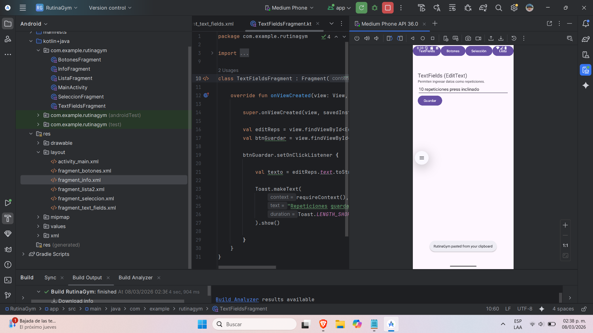
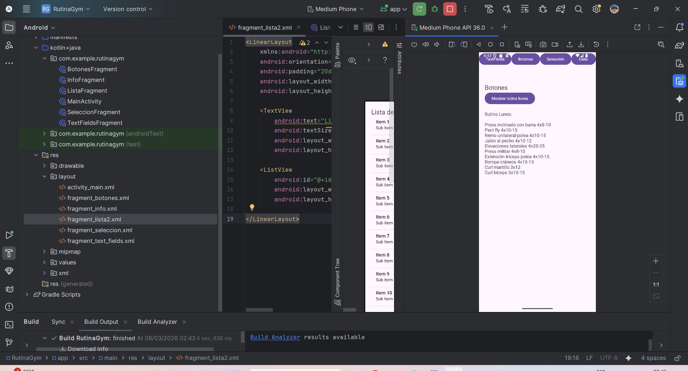
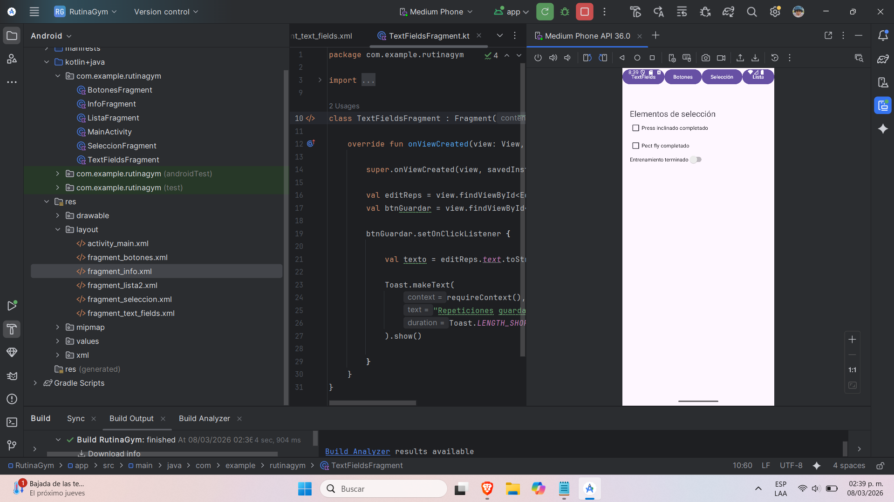
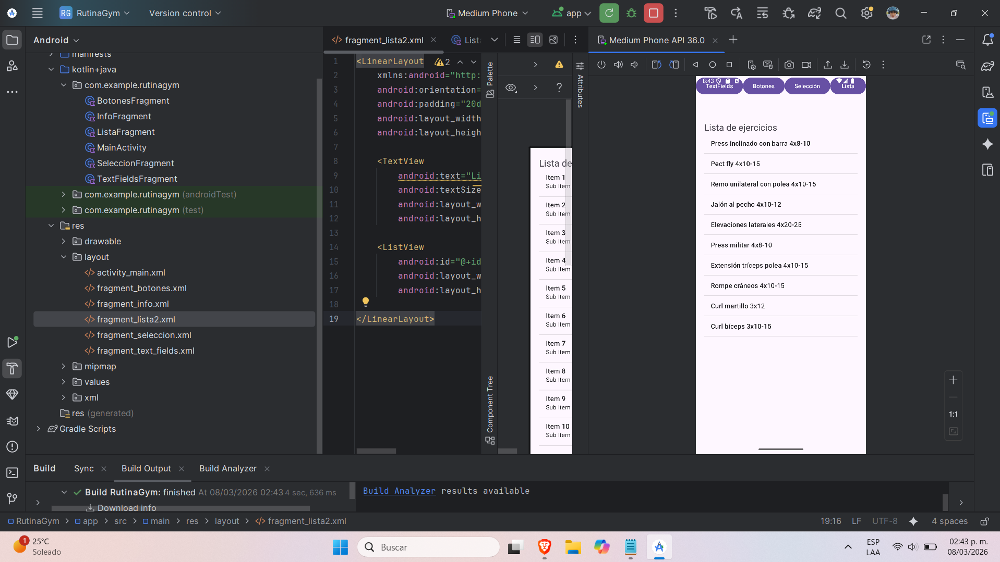

# RutinaGymUI

Bernal Ramirez Brian Ricardo

## Descripción de la aplicación

RutinaGymUI es una aplicación Android desarrollada en Kotlin que demuestra el uso de diferentes elementos de interfaz de usuario mediante el uso de Activities y Fragments.  
Cada fragment muestra un tipo distinto de componente de interfaz y permite al usuario interactuar con él utilizando ejemplos relacionados con una rutina de ejercicios semanal.

---

# Capturas de pantalla

## Fragment 1 - TextFields

Este fragment muestra el uso de EditText para que el usuario pueda introducir datos.

---

## Fragment 2 - Botones

Este fragment muestra cómo funcionan los botones en Android.  
Al presionar el botón se muestra la rutina de ejercicios.

---

## Fragment 3 - Elementos de Selección

Incluye componentes como CheckBox y Switch que permiten marcar ejercicios como completados.

---

## Fragment 4 - Lista de Ejercicios

Este fragment muestra una lista de ejercicios utilizando un ListView.

---

# Instrucciones de uso

1. Abrir la aplicación en Android Studio.
2. Ejecutar la aplicación en un emulador o dispositivo físico.
3. Utilizar los botones superiores para navegar entre los diferentes fragments.
4. Probar la interacción de cada componente de interfaz.
